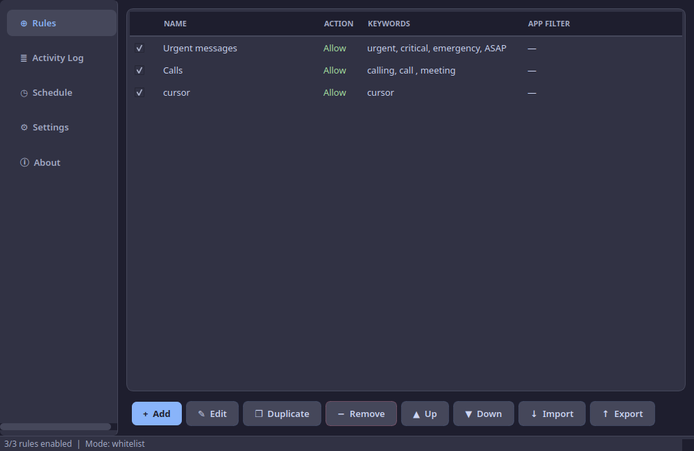
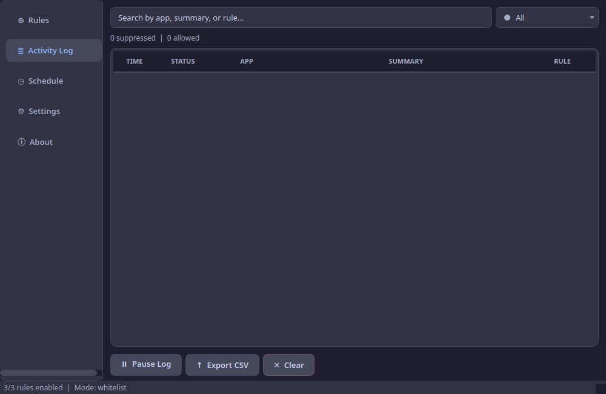
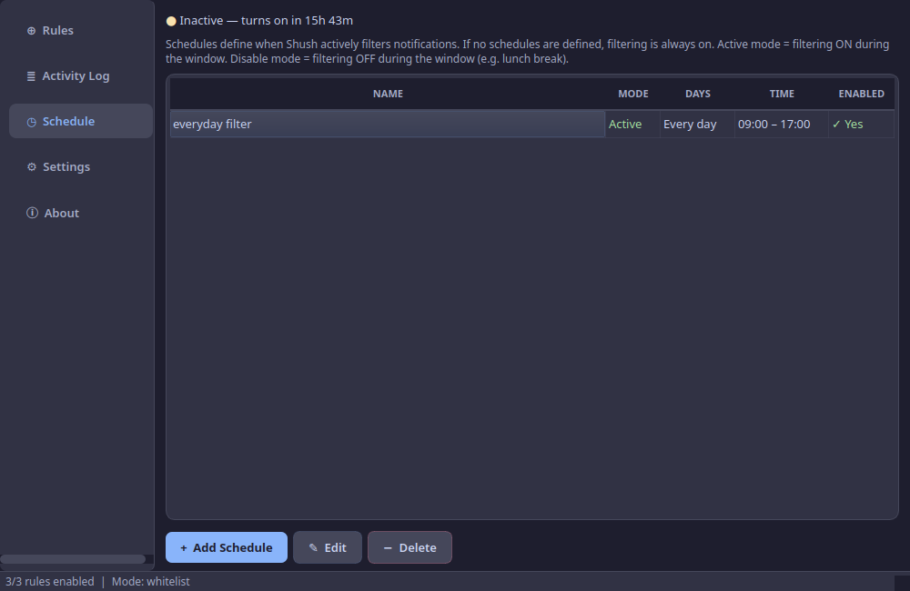
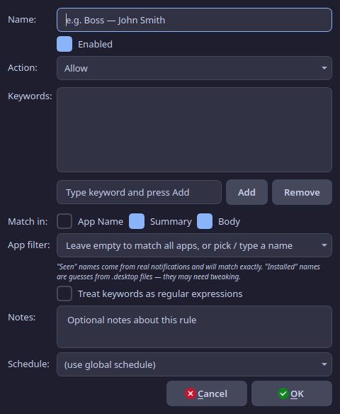
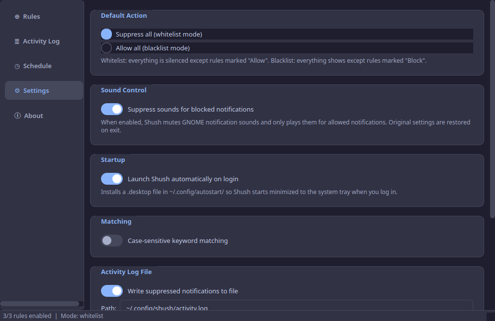
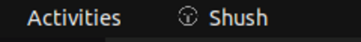

<p align="center">
  
</p>

<h1 align="center">Shush</h1>

<p align="center">
  <strong>Linux notification filter with a beautiful GUI.</strong><br>
  Keep only the notifications you care about. Silence the rest.
</p>

<p align="center">
  <a href="https://pypi.org/project/shush-notifications/"></a>
  <a href="https://pypi.org/project/shush-notifications/"></a>
  <a href="LICENSE"></a>
  <a href="https://github.com/eslamsalahelsheikh/shush/actions"></a>
</p>

---

Shush sits on the D-Bus session bus, watches every desktop notification, and
instantly suppresses the ones you don't care about. Only the notifications
matching your keyword rules make it through — your boss's messages, Teams
calls, urgent alerts — everything else is silenced.

Works on **any Linux desktop environment** (GNOME, KDE, XFCE, Sway, i3, …)
without replacing your notification daemon.

## Screenshots

<p align="center">
  <br>
  <em>Rules tab — create keyword-based notification rules</em>
</p>

<p align="center">
  <br>
  <em>Activity Log — live view of allowed/suppressed notifications with search and stats</em>
</p>

<p align="center">
  <br>
  <em>Schedule tab — automated time-based filtering</em>
</p>

<p align="center">
  <br>
  <em>Rule editor — keywords, regex, app filter, schedule assignment</em>
</p>

<p align="center">
  <br>
  <em>Settings — mode, autostart, sound control, case sensitivity</em>
</p>

<p align="center">
  <br>
  <em>System tray — badge shows suppressed count, quick pause/resume</em>
</p>

---

## Getting Started in 30 Seconds

```bash
pip install shush-notifications
shush
```

1. Click **+ Add** to create your first rule
2. Enter keywords like your boss's name or "meeting"
3. Set mode to **Whitelist** (suppress all, allow only matches) or **Blacklist** (allow all, block matches)
4. Minimize to tray — Shush runs quietly in the background

---

## Why Shush?

| Feature | Shush | GNOME NotifyFilter | Dunst rules | nofi |
|---|---|---|---|---|
| Works on any DE | Yes | GNOME 45+ only | Yes (replaces daemon) | Yes (replaces daemon) |
| GUI rule editor | Yes | Basic | No (config file) | No |
| Per-person rules | Yes | No | Manual | No |
| Per-app filtering | Yes | No | Yes | Partial |
| Keywords + regex | Yes | Text only | Regex | No |
| Live activity log | Yes | No | No | No |
| Search & filter log | Yes | No | No | No |
| Per-app statistics | Yes | No | No | No |
| Focus-mode presets | Yes | No | No | No |
| Time-based schedules | Yes | No | No | No |
| Import/export rules | Yes | No | No | No |
| System tray + badge | Yes | N/A | N/A | N/A |
| Keyboard shortcuts | Yes | No | No | No |
| pip installable | Yes | No | No | cargo |
| Autostart toggle | Yes | No | N/A | No |
| No daemon replacement | Yes | Yes | No | No |

---

## Features

- **Keyword & Regex Rules** — match on app name, summary, or body with plain text or regex
- **Whitelist / Blacklist Modes** — suppress-all-except or allow-all-except
- **Per-App Filtering** — auto-discover installed apps from `.desktop` files or learn from live D-Bus traffic
- **Time-Based Schedules** — enable/disable filtering on a weekly schedule with Active and Disable modes (disable wins on conflicts)
- **Per-Rule Schedules** — assign individual rules to specific schedules
- **Activity Log** — real-time view of every notification with status, searchable and filterable
- **Per-App Statistics** — see which apps generate the most noise
- **System Tray** — badge shows suppressed count; click to open, right-click for quick actions
- **Import / Export Rules** — share rule sets as JSON files
- **Keyboard Shortcuts** — `Ctrl+1-5` tab switching, `Ctrl+N` new rule, `Ctrl+F` search, `Ctrl+Q` quit
- **Sound Control** — mute GNOME notification sounds for blocked notifications
- **SIGHUP Reload** — edit `~/.config/shush/rules.json` by hand, then `kill -HUP` to reload
- **Autostart** — one-click toggle to launch on login via `~/.config/autostart/`
- **Catppuccin Mocha Theme** — a beautiful dark UI with blue accent
- **Focus Presets** — named rule subsets for meetings, deep work, etc.

---

## Installation

### From PyPI (recommended)

```bash
pip install shush-notifications
```

### From source

```bash
git clone https://github.com/eslamsalahelsheikh/shush.git
cd shush
pip install -e .
```

### Debian / Ubuntu (.deb)

```bash
sudo apt install python3-pyqt5 python3-dbus python3-gi
dpkg-buildpackage -us -uc
sudo dpkg -i ../shush_0.2.0-1_all.deb
```

### System dependencies

Shush needs these system packages (most distros have them pre-installed):

- Python 3.8+
- PyQt5
- dbus-python
- PyGObject (GLib introspection)

On Ubuntu/Debian:

```bash
sudo apt install python3-pyqt5 python3-dbus python3-gi gir1.2-glib-2.0
```

On Fedora:

```bash
sudo dnf install python3-qt5 python3-dbus python3-gobject
```

On Arch:

```bash
sudo pacman -S python-pyqt5 python-dbus python-gobject
```

---

## Usage

```bash
# Launch with GUI
shush

# Start minimized to system tray
shush --minimized

# Dry run — log what would be suppressed without actually closing anything
shush --dry-run

# Verbose logging
shush -v
```

### Auto-start on login

Enable autostart from **Settings > Startup > Launch Shush automatically on login**, or manually:

```bash
cp data/shush.desktop ~/.config/autostart/
```

### Keyboard shortcuts

| Shortcut | Action |
|---|---|
| `Ctrl+1`..`Ctrl+5` | Switch tabs |
| `Ctrl+N` | New rule |
| `Ctrl+F` | Focus log search |
| `Ctrl+Q` | Quit |

---

## How It Works

```
┌──────────────────────────────────────────────┐
│  Your Apps (Slack, Teams, Firefox, …)        │
│  send Notify() over D-Bus                    │
└──────────┬───────────────────────────────────┘
           │
           ▼
┌──────────────────────────────────────────────┐
│  Notification Daemon                         │
│  (gnome-shell / KDE / dunst / mako / …)     │
│  displays the notification, returns an ID    │
└──────────┬───────────────────────────────────┘
           │
           ▼
┌──────────────────────────────────────────────┐
│  Shush (message filter on the session bus)   │
│                                              │
│  1. Intercepts the Notify() arguments        │
│  2. Checks keywords against your rules       │
│  3. Checks schedule (time-based filtering)   │
│  4. If no rule matches → CloseNotification() │
│  5. If a rule matches → notification stays   │
└──────────────────────────────────────────────┘
```

Shush **does not replace** your notification daemon. It eavesdrops on the
D-Bus session bus and calls `CloseNotification(id)` on notifications that
don't match your rules. This means it works alongside whatever notification
system your desktop already uses.

---

## Configuration

Rules are stored in `~/.config/shush/rules.json`. You can edit them through
the GUI or by hand. Send `SIGHUP` to reload after manual edits:

```bash
kill -HUP $(pgrep -f 'python.*shush')
```

### Rule structure

Each rule has:

- **Name** — a human label (e.g., "Boss — Ahmed")
- **Action** — `allow` or `block`
- **Keywords** — list of strings (or regex patterns) to match
- **Match fields** — which notification fields to search: `app_name`, `summary`, `body`
- **App filter** — optional, restrict the rule to a specific app (e.g., "Slack")
- **Schedule** — optional, restrict the rule to a specific time schedule
- **Use regex** — treat keywords as regular expressions
- **Enabled** — toggle without deleting

### Modes

- **Whitelist (default):** suppress everything; only notifications matching
  an "allow" rule get through.
- **Blacklist:** allow everything; only notifications matching a "block" rule
  are suppressed.

### Schedules

Create weekly time schedules with two modes:

- **Active mode** — filtering is ON during the specified days/hours
- **Disable mode** — filtering is OFF during the specified days/hours

When Active and Disable schedules overlap, **Disable wins** — this lets you
carve out "lunch break" or "meeting" windows inside a broader active schedule.

### Focus presets

Create named presets (e.g., "Meeting", "Deep Work") that activate only a
subset of your rules. Switch presets from the Settings tab or the system tray.

---

## Contributing

See [CONTRIBUTING.md](CONTRIBUTING.md) for development setup, testing, and
release instructions.

---

## License

[Apache License 2.0](LICENSE)
